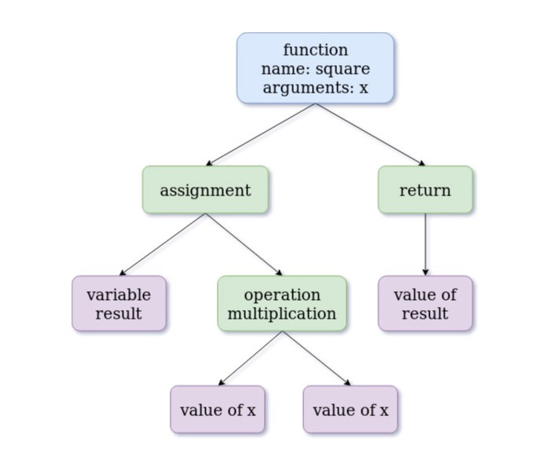

# Javascript Creation and Execution Phase

> When a JavaScript engine executes a script, it creates execution contexts. Each execution context has two phases: the **`creation`** phase and the **`execution`** phase.(We will cover this concept in future)

**Here is an exmaple**: [Creation and Execution phase](https://medium.com/@sudhakarsp06/creation-phase-and-execution-phase-in-javascript-32fcdbef60f4)

1. `Tokenizing`: `var x = 1;`
   `<KEYWORD, var> <ID, x> <EQUALS> <INTEGER, 1> <SEMICOLON>`
2. `Parsing`:
   - It'll generate `AST` and check syntax against `language rules`. e.g. `assignment = ID followed-by EQUALS followed-by INTEGER`

```javascript
function square(x) {
  var result = x * x;
  return result;
}
```

The AST representation will look like:

<div style="text-align:center"></div>

So If a code has a syntax error, it will throw an error:

```javascript
var validCode = function() {
  alert('valid code ran!');
};
validCode();
// on purpose syntax error after valid code that could run
syntax(Error()
/*Output:
Uncaught SyntaxError: missing ) after argument list
*/
```

3. `Code Generation`: When a script executes for the first time, the JavaScript engine creates a `Global Execution Context`. During this creation phase, it performs the following tasks:

- Create a global object i.e., `window` in the web `browser` or `global` in `Node.js`.
- Create a `this` object binding which points to the global object above.
- Setup a memory heap for storing variables and function references.
- Store the function declarations in the memory heap and variables within the global execution context with the initial values as `undefined`.
  ...
  [ReadMore](https://www.javascripttutorial.net/javascript-execution-context/)
