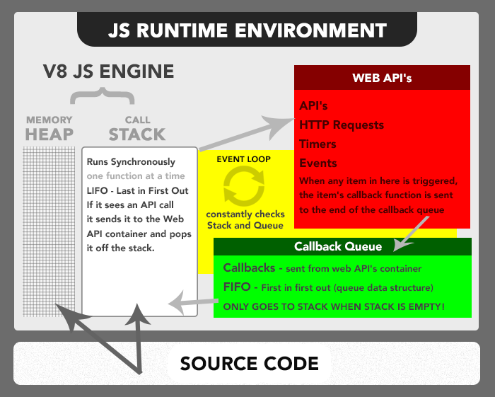

# Javascript Engine vs Enviroment

- **Engine:** The JavaScript engine translates your script into runnable machine code instructions so it can be executed by the CPU of the `target` machine. The engine translates scripts at `runtime on the fly`, So, your code won’t be compiled unless you run it. So, A JavaScript engine is a computer program that executes JavaScript (JS) code. Since `ECMAScript (ES)` is the `standardized specification` of JavaScript, `ECMAScript engine` is another name for these engines.[JS Engine](https://en.wikipedia.org/wiki/JavaScript_engine)

  `Here is the List of Engines:` [JS enviroment and engine](http://dolszewski.com/javascript/javascript-runtime-environment/)

  - `Chrome V8` : From Google

    > _Used In: Used in Chrome Browser, NodeJS & in android based mobiles_

  - `SpiderMonkey` : From Mozilla

    > _Used In: Used in Firefox Browser_

  - `Nitro / JavascriptCore` : From Apple

    > _Used In: Used in Safari Browser & in iOS based mobiles_

  - `Chakra & CharkraCore` : From Microsoft

    > _Used In: Used in Microsoft Edge Browser_

- **Enviroment:** The JavaScript engine works inside an environment. It provides additional features with utility libraries `which are not part of the language` that can be used during execution. These can be utility libraries or `APIs which allow communicating` with the world surrounding the `engine`. [Engine vs Runtime](https://olinations.medium.com/the-javascript-runtime-environment-d58fa2e60dd0)
  `Here is a list of Runtime Environments`:

  - `Browser`: Provides **DOM** API, **Fetch** API, Timer(**setTimeout & setInterval**), Storage(like Local Storage) etc.

    > _Example: Chrome, Firefox, Safari, Opera, Edge_ etc

  - `Server Environment`: Provides **File System** Access, **Network** Access, Console etc.

    > _Example: NodeJS, Deno_

  - `Desktop Environment`: Provides **GUI API**, **File System** Access, **Network** Access, Console etc.

    > _Example: Electron etc._

  - `Mobile Environment`:

    > _Example: NativeScript, Ionic, PhoneGap, React Native etc_

