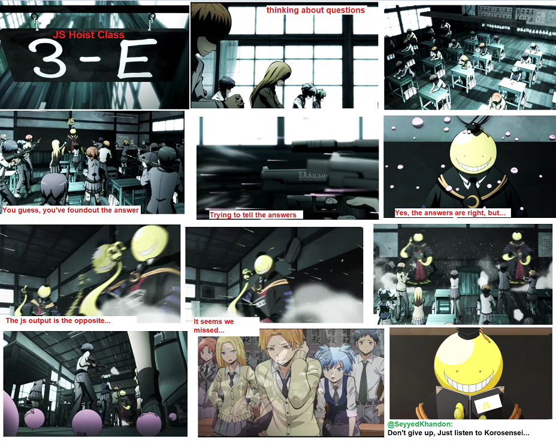

# Episode 1

## Persian:

 

`Koro-sensei:` Well well😁, Did you see that all of your answers were incorrect, and you couldn't do anything😁😝.
But don't worry, because the reason behind it, is that you don't know how `JS Engine` works, You don't know what is happening behind the scene!🧐.
**Note:** So, keep this in mind, If you really plan to be an `Expert Assassin` you have to gather as much as possible information about your `target`, to be able to land a flawless attack on it.
Now, we are gonna learn a little bit about how does `V8 Engine`® sees our scripts and executes them.
`Q1:` pheeww🤒, Does Anyone know how browser `understands` our `scripts`?

`Developer`: It'll use `Compile` mechanism?

`Kaede`: sensei, I think it's an `interperter`?

`Koro-sensei:` hmmm, you are close but not right, Can anyone tell what do `Compile, interperter` means?

`Nagisa`:☝

- `Compile`: Code compilation is a set of steps that process the text of your code and turn it into a list of instructions the computer can understand. Typically, `the whole source code is transformed at once, and those resulting instructions are saved as output` (usually in a file) that can later be executed.
- `Interpretation`: Interpretation performs a similar task to compilation, in that it transforms your program into machine-understandable instructions. But the processing model is different. Unlike a program being compiled all at once, with interpretation the source code is transformed line by line; each line or statement is executed before immediately proceeding to processing the next line of the source code.

`Karma`: Sensei, it uses `JIT(Just-In-Time/Runtime Compilations)` 😎

- Today Javascript uses `JIT(dynamic translation)` which is a combination of the two traditional approaches for translation human readable code to machine code(`AOT(ahead-of-time compilation)` + `interpretation(line by line)` + other advanced techniques) .[JIT-WikiPedia](https://en.wikipedia.org/wiki/Just-in-time_compilation), [v8Engine-medium](https://blog.sessionstack.com/how-javascript-works-inside-the-v8-engine-5-tips-on-how-to-write-optimized-code-ac089e62b12e)

`Koro-sensei:`👏👏👏 ahsant `karma` and `nagisa`, You are right, `Javascript v8 engine uses JIT`, I suggest to see this general `5 min` video about [--Compile vs Interpret and JIT--](https://www.aparat.com/v/GXJFP).
Generally `Javascript` has 2 step to understands and run our scripts: `Creation phase, Execution phase`.

##### 1. Creation Phase(Prepration/Parsing/Compilation):

First , JS engine will examine our JS codes(e.g. `var x = 1;`) ,And do some stuff on that as below:[YDKJS-Scope and Clouser](https://github.com/getify/You-Dont-Know-JS/blob/2nd-ed/scope-closures/ch1.md)

- `Tokenizing/Lexing`: First, the engine reads the `JS` code and builds a set of tokens. `['var','x','=','1',';']` (preparing lexical scope)
- `Parsing`: Engine checks if the script matches the `syntax rules` and Parsing the source code as plain text and converting to a data structure called abstract syntax tree (`AST`) which is collectively represent the grammatical structure of the program.
- `Code Generation`: Turning `AST` into excutable-code (a set of machine instructions to create a variable called `a` , reserving memeory, store `1` to `a`)[Creation and Execution phase](https://medium.com/@sudhakarsp06/creation-phase-and-execution-phase-in-javascript-32fcdbef60f4)
  > - It picks all function declarations and stores them in memory with their reference.
  > - It picks all variables and assign `undefined` to them. In the event of a conflict between variable and function declaration name then that variable is ignored.

[--ReadMore-example--](./creation_execution_phase_example.md)

##### 2. Execution Phase

    * Execute line by line(Variables assigned with values or Functions execution)

   
`students:` hoooff...😵

`Koro-sensei:`
**Note**: It actually is more complicated than these steps, and JS does these and some other advanced process in mere microseconds.[YDKJS-Scope and Clouser](https://github.com/getify/You-Dont-Know-JS/blob/2nd-ed/scope-closures/ch1.md), [Compiler anatomy](http://www.cs.man.ac.uk/~pjj/farrell/comp3.html)
We will Cover `Execution Context` later in the future Chapters. `JS` is more complicate than what we think 😈, but Dont worry, when you get used to know it, it will be `easy peasy lemon squeezy`😇

Well thats enough for this `episode`, we will talk about `hoist`, `scope`,etc. in the next `episode` with `real world examples`😍 and you will be able to analyse them.

---

### Comments:

> `SeyyedKhandon:` You may heard of **Engine**, **Runtime** and confused about it, here is a quick answer:

- `Engine`: Translates your scripts at `Runtime on the fly` into runnable machine code instructions.
- `Enviroment`: Engine works inside an environment. It provides additional features like `DOM api, Fetch, Timer etc.` with utility libraries which can be used during execution.
  [--ReadMore--](./engine_vs_enviroment.md)

### Contribute

- Your first contribution can be as simple as clicking the `star` button at the top-right corner of the page.
- I would greatly appreciate any `bug fixes` or `type/grammatical errors fixes`.
- The mini-series will be in English, but any translation in other languages is very welcomed.
- We plan to make mini-series videos in `Persian`, but any help to make the `English` version, will be greatly appreciated and welcomed.

### Some of Current used resources:

- [YDKJS-Scope and Clouser](https://github.com/getify/You-Dont-Know-JS/blob/2nd-ed/scope-closures/ch1.md)
- [JIT-WikiPedia](https://en.wikipedia.org/wiki/Just-in-time_compilation)
- [v8Engine-medium](https://blog.sessionstack.com/how-javascript-works-inside-the-v8-engine-5-tips-on-how-to-write-optimized-code-ac089e62b12e)
- [readMore-compiler anatomy](http://www.cs.man.ac.uk/~pjj/farrell/comp3.html)
- [W3schools-js hoist](https://www.w3schools.com/js/js_hoisting.asp)
- [W3schools-js scope](https://www.w3schools.com/js/js_scope.asp)
- [W3Schools-js variables](https://www.w3schools.com/js/js_variables.asp)
- [Mozila-statements](https://developer.mozilla.org/en-US/docs/Web/JavaScript/Reference/Statements)
- [Sitepoint-declaration ](https://www.sitepoint.com/how-to-declare-variables-javascript/)
- [YDKJS-scope-closure](https://github.com/getify/You-Dont-Know-JS/blob/2nd-ed/scope-closures/ch5.md)
