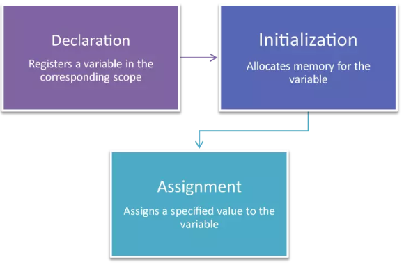
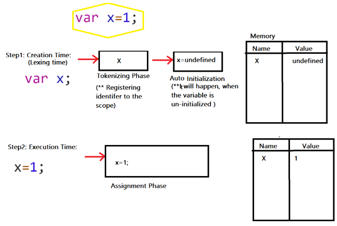
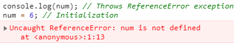

# Episode 2

### JavaScript Base Concepts(Hoist,)

<div style="text-align:center"></div>

<br/>


`kaede`: hey nagisa, should we tell him?🤔


`nagisa`: hmmm, about what?😅


`kaede`: About real `practice`🙄, how should we really learn with just theoris?


`nagisa`: ahaaa😂, Yep, I'm agree, do you want me to tell him?


`kaede`: No, I'll tell him my-self. `Sensei`, when do we start the practical tests? I think with just theories we can be a real assassin😔


`Korosensei`: You are right `kaede`, We will parcrice today alot...😁 specially about some intersting questions which you are faceing at `interviews`😍.

but, before that, you should know the some crucial conepts, Now everyone lets begin, are you ready???

 
 
 


`Class`: Yessssss

<div style="text-align:center"></div>


`korosensei`: So everyone, put your guns down and listen very well:
`korosensei`: Anyne knows exact definition of `Hoisting`?


`nagisa`: is'nt it about:

> Hoisting is JavaScript's default behavior of `moving all declarations to the top of the current scope` (to the top of the current script or the current function).[W3schools](https://www.w3schools.com/js/js_hoisting.asp) e.g. `

```javascript
var x = 10;
///----this 1-line is converting to these below lines:-----
var x;
x = 10;
```


`korosensei`: that's right nagisa🎉, but this is not in fact what happens. Hoisting was thought up as a general way of thinking about how **execution contexts** (specifically the `creation and execution phases`) works in `JavaScript`. So, behind the scene what is happening is, **the variable and function declarations are put into memory during the compile phase, but stay exactly where you typed them in your code**. but we consider them as what you said.[hoisting-glossary](https://developer.mozilla.org/en-US/docs/Glossary/Hoisting)


`korosesei`: So, tell me, my assassins, is this even usefull to `hoist` the `declarations`?


`karma`: yes sensei, One of the advantages of `JavaScript` putting function declarations into memory before it executes any code segment, is that it allows us to use a function before you declare it in your code.


`korosensei`: Ahsant `karma👏`, lets see some examples:

```javascript
// normal code
function catName(name) {
  console.log("My cat's name is " + name);
}
catName("Tiger");
//output: My cat's name is Tiger
```

The above snippet was a normal code, now lets see this:

```javascript
catName("Tiger");
function catName(name) {
  console.log("My cat's name is " + name);
}
//output: My cat's name is Tiger
```

Note that, Even though we call the function in our code first(`before the function is written`), the code still works. This is because of `how context execution works in JavaScript`.


`nagisa`: Sensei, I wonder, what does `declaration` means exactly?


`koorosensei`: ahhh, that's a good question `nagisa`,Actually

> Creating a variable in JavaScript is called **declaring a variable**.[W3Schools](https://www.w3schools.com/js/js_variables.asp) , And I should say, We can use **var, let, const, function, function\*, class** to create a variable in the memory.[Mozila](https://developer.mozilla.org/en-US/docs/Web/JavaScript/Reference/Statements)


`kaede`: I heard about `initialization` and `assignment`, can you explain these?


`korosensei`: I was going to explain them😊, Please look at this `variable life-cycle`:[Sitepoint](https://www.sitepoint.com/how-to-declare-variables-javascript/)

<div style="text-align:center"></div>

- `Declaration`: The variable is registered using a given name within the corresponding scope (explained below – e.g. inside a function).
- `Initialization`: When you declare a variable it is automatically initialized, which means memory is allocated for the variable by the JavaScript engine.
- `Assignment`: This is when a specific value is assigned to the variable.(at `execution time`)

##### `var` life-cyle in action: [YDKJS](https://github.com/getify/You-Dont-Know-JS/blob/2nd-ed/scope-closures/ch5.md)

```javascript
var x = 1; // In fact, Engine sees two distinct statements:
// one that Compiler will handle during compilation,
// and one that Engine will handle during execution
```

<div style="text-align:center"></div>


`Korosensei`: Now see these 2 examples to understand better:

<details>
<summary>
<i>Example 1(click to see)</i>
</summary>

```javascript
//e1
var x = 1;
//e2
var x = 1;
var x; //`var` can be redeclared multiple time at the same scope-level, but the only  first will be used and others will be ignored
//e3
x = 1;
var x;
//-------------------------------------------------------
//-------these 3 examples are equal to the below code--->
//-------------------------------------------------------
var x; // declaration and auto-initialization phase
x = 1; // assignment phase
```

</details>
<details>
<summary>
<i>Example 2(click to see)</i>
</summary>

```javascript
//e4
var x = 1;
var x = 2;
var y = 5;
//------- above example is equal to the below code--->
var x; // declaration and auto-initialization phase
var y; // declaration and auto-initialization phase
x = 1; // assignment phase
x = 2; // assignment phase
y = 5;
```

</details>


`koro sensei`: let see some `interview level` quizzes, I'll explain the first one, and the others are yours:

```javascript
//q1
console.log(num); // line 1
var num; // Declaration
num = 6; // Initialization
```

`line 1` Returns `undefined`, as only declaration by `var` was hoisted with `auto-initialize` to `undefined`, and no `initialization` has happened at `line 1` or before that by `assignment`.
**Note**: JavaScript only hoists `declarations`, not `initializations`.


`korosensei`: Now it's your turn, anyone know what will happen and why?😈

```javascript
//q2
console.log(num);
num = 6;
```


`developer`: sensei ,It will hoist the `num`, so the answer is `undefined`. easy peasy😎


`koro-sensei`: ahsant `developer`, but that's not correct😂. `karma` can you explain?


`karma`: sensei, as you told us before, decalration will happen when we use `var,let,const,function, function*, class`, which there is'nt any here in this `quiz`, and it has only the initialization(`assignment`), so i think it throws `ReferenceError exception`, because at the line 1, it wants to access `num` in the memory, but there is no `num` in there yet.
let me check this plz:

<div style="text-align:center"></div>


`koro-sensei`: barikala `karma`👏👏😍🎉, let see another example, and `developer`, as what you learned, explain this to the class:

```javascript
// q3
x = 1;
console.log(x + " " + y);
var y = 2;
```


`developer`: ok, sensei, I'll try it:

<details>
<summary>
<i>See the answer after thinking about it atleast 2min</i>
</summary>

```javascript
var y; // Declare y (Only y is hoisted)
x = 1; // Initialize x, and if not already declared, declare it
// but no hoisting for `x` as there is no var in the statement.
console.log(x + " " + y); // '1 undefined'
// This prints value of y as undefined as JavaScript only hoists declarations
y = 2; // Initialize y
```

</details>


`koro-sensei`: Wow, i'm really happy😍, how about this?`developer`:

```javascript
foo();
function foo() {
  console.log("hi");
}
```


`developer`: hmm sensei😎, r you kidding me?

<details>
<summary>
<i>See the answer after thinking about it atleast 2min</i>
</summary>

```javascript
//first hoist the declaration
function foo() {
  console.log("hi");
}
// then run it at execution time
foo();
// hi
```

</details>


`korosensei`: hmmm, got full of yourself?😈 try this:

```javascript
foo();
var foo = function () {
  console.log("hi");
};
/* or this
foo() 
var foo = function foo() {  console.log('hi'); }
*/
```


`developer`: ahmmm, let me think about it a little more🤔...
I hope this is correct:

<details>
<summary>
<i>See the answer after thinking about it atleast 2min</i>
</summary>

```javascript
var foo; // first hoist `foo` declaration at creation time
foo(); // the run it at execution time, which should get an error because we are going to "undefined()"?
foo = function () {
  // here is assignment
  console.log("hi");
};
```

</details>


`korosensei`: Yes, yes, afarin `developer`😍😍🎉🎉👏👏👏. in this example we are facing with [Function expression](https://developer.mozilla.org/en-US/docs/web/JavaScript/Reference/Operators/function) instead of a [function declaration](https://developer.mozilla.org/en-US/docs/Web/JavaScript/Reference/Statements/function). So, it just a simple assignment which assigns a function to the foo after assignemnt, therefor until `execution` of `assignement` , foo remains `undefined`.

```javascript
var foo;
foo = function foo() {
  console.log("hi");
};
```


`korosensei`: Now `kaede`,it's your turn, tell us:

```javascript
foo();
function foo() {
  console.log("1");
}
foo();
function foo() {
  console.log("2");
}
var foo;
foo();
```


`kaede`: sensei, first we will do the hoist operations at creation time, then execute them at `execution time`

<details>
<summary>
<i>See the answer after thinking about it atleast 2min</i>
</summary>

```javascript
// first this will be declared
function foo() {
  console.log("1");
}
// second this will be declared, so the previous `foo` will be updated by this new declaration
function foo() {
  console.log("2");
}
var foo; // this will be ignored, because `foo` has been declared in the same scope.
foo(); //2
foo(); //2
foo(); //2
```

</details>


`korosensei`: tell me about this `kaede`

```javascript
// q4
function foo() {
  console.log(a, b);
}
a = "Cran"; // Initialize a
b = "berry"; // Initialize b
console.log(a + "" + b); // 'Cranberry'
foo();
```


`kaede`:sensei, `No hoisting` for `a,b` happens here except `foo`, but since initialization also causes declaration (if not already declared), variables `a,b` are available everywhere after assignments. but I'm not sure what happens about `foo`, but i think it will print `Cran berry` without `error`, because `foo` access them after their `declaration and initialization`.


`korosensei`: nice answer, beutiful `kaede`, you are right, and thats because of something which we refer to as `scope`. which I strongly recommend to read it here [--ReadMore-Scope--](./scope.md)

Now `nagisa`, it's your turn, explain this:

```javascript
var myvar = 1;
(function () {
  console.log(myvar);
  var myvar = 2;
})();
```


`nagisa`: Well, it's just an [IIFE-Immediately Invoked Function Expression](https://developer.mozilla.org/en-US/docs/Glossary/IIFE), which we can rewrite this as below:

<details>
<summary>
<i>See the answer after thinking about it atleast 2min</i>
</summary>

```javascript
var myvar;
myvar = 1;
(function () {
  var myvar;
  console.log(myvar);
  var myvar = 2;
})();
// so the output should be `undefined`
```

</details>


`Korosensei`: Well done `nagisa`, now let the `karma` answer this last quiz😈:

```javascript
(function () {
  var a = (b = 3);
})();

console.log(b);
console.log(a);
```


`Karma:`

<details>
<summary>
<i>See the answer after thinking about it atleast 2min</i>
</summary>

For this, first we declared `a` then we defined `b` without var , so it will be a `global` variable and will be acessible outside of `IIFE` function, then we set the value of `b` into `a`, then the `IIFE` function has been finished, so after that, the only variable which has been declared and defined is `b` and there is no `a`, so we will get `Uncaught ReferenceError: a is not defined`

```javascript
(function () {
  var a;
  b = 3;
  a = b;
})();

console.log(b); // 3
console.log(a); // Uncaught ReferenceError: a is not defined
```

</details>


`karma`: Sensei, you didnt mentioned `let and const` in the examples!!!!!!


`korosensei`: hmmm, you are right, We will see them in `episode5`(which is about `temporal dead zone` and other stuffs), but let us see a quick quiz/answer:

```javascript
// Example with let:
a = 1; // initialization.
let a; // Throws ReferenceError: Cannot access 'a' before initialization

var z = 1;
let z; //Identifier ‘z’ has already been declared
console.log(z);

// Example with const:
a = 1; // initialization.
const a; // Throws SyntaxError: Missing initializer in const declaration
```


`Korosensei`: Congratulions🎉🎉🎉. Now you should be able to answer all of these quizzes in this [article](https://medium.com/@pvivek4/hoisting-demystified-with-popular-interview-questions-38a93ea441ff).

 
 
 


`Class`: Horrayyyyyyyyy😍😍🎉🎉👏👏👏👏`

### Contribute

- Your first contribution can be as simple as clicking the `star` button at the top-right corner of the page.
- I would greatly appreciate any `bug fixes` or `type/grammatical errors fixes`.
- The mini-series will be in English, but any translation in other languages is very welcomed.
- We plan to make mini-series videos in `Persian`, but any help to make the `English` version, will be greatly appreciated and welcomed.

### Some of Current used resources:

- [YDKJS-Scope and Clouser](https://github.com/getify/You-Dont-Know-JS/blob/2nd-ed/scope-closures/ch1.md)
- [JIT-WikiPedia](https://en.wikipedia.org/wiki/Just-in-time_compilation)
- [v8Engine-medium](https://blog.sessionstack.com/how-javascript-works-inside-the-v8-engine-5-tips-on-how-to-write-optimized-code-ac089e62b12e)
- [readMore-compiler anatomy](http://www.cs.man.ac.uk/~pjj/farrell/comp3.html)
- [W3schools-js hoist](https://www.w3schools.com/js/js_hoisting.asp)
- [W3schools-js scope](https://www.w3schools.com/js/js_scope.asp)
- [W3Schools-js variables](https://www.w3schools.com/js/js_variables.asp)
- [Mozila-statements](https://developer.mozilla.org/en-US/docs/Web/JavaScript/Reference/Statements)
- [Sitepoint-declaration ](https://www.sitepoint.com/how-to-declare-variables-javascript/)
- [YDKJS-scope-closure](https://github.com/getify/You-Dont-Know-JS/blob/2nd-ed/scope-closures/ch5.md)
