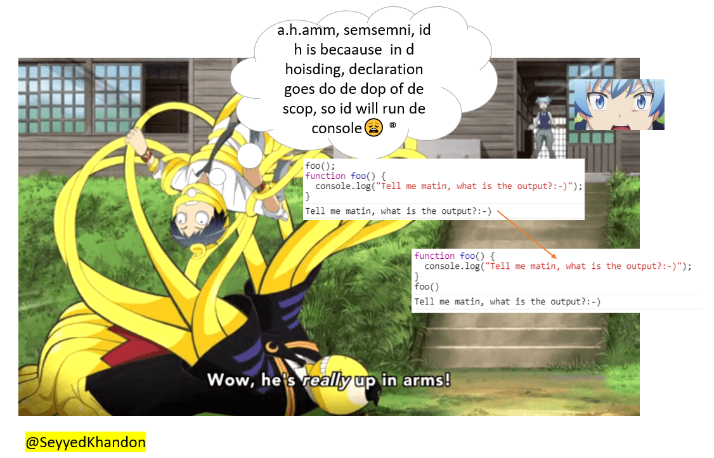
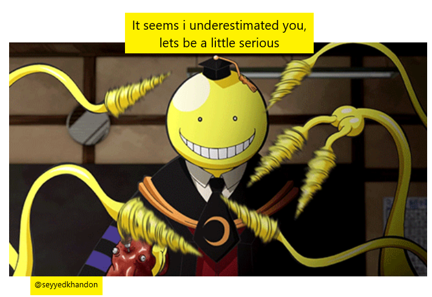
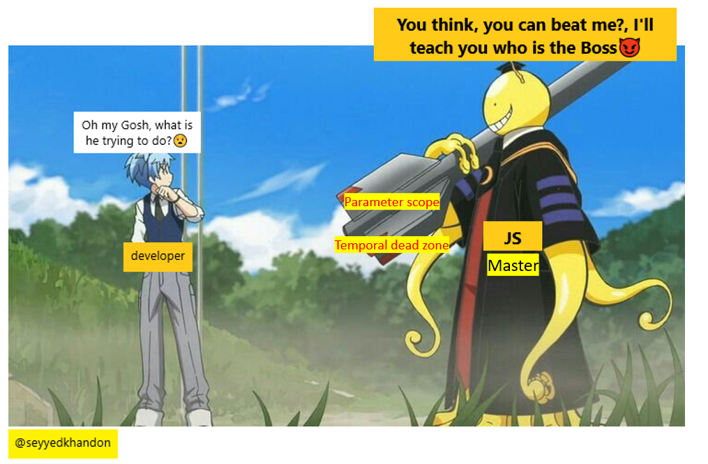

# Preview

<div style="text-align:center"></div>

### You will learn How to beat the `Master`

<div style="text-align:center"></div>


`Nagisa`: What are you doing Koro sensi😱🥴???


`Koro sensei`: Playing with him, can you see how he is messed-up and stuck at these?😈😅

```javascript
//attack level-1==> Calling the function `foo` before its declaration
foo();
function foo() {
  console.log("Tell me matin, what is the output?:-)");
}
```


`Nagisa`: oh oh, `matin`, listen to me, remember `hoisting` definition and tell him.🤠

  <div style="text-align:center"></div>


`developer`:a.h.amm, semsemni, id h is becaause in d hoisding, declaration goes do de dop of de scop, so id will run de console😩®


> `SeyyedKhandon`: Where ever you see a ®, there will be a detail/explanation/description for that. e.g. aha, sensi, it is because in the hoisting, declaration goes to the top of the scope, so it will run the console

```javascript
// at-l1==:
function foo() {
  console.log("Tell me matin, what is the output?:-)");
}
foo();
//===================================================
```


`Koro Sensi`: hmmmm...!, How about these two?

```javascript
// Attack level-2===> Calling the function before its assignment and declaration
foo();
var foo = function () {
  console.log("Easy peasy hah? got stuck?😈");
};
```

```javascript
foo();
var foo = function foo() {
  console.log("Seems to be full of yourself, ✌");
};
```


`kaede`: `developer`, remember, the `rhs` and `lhs`...

<div style="text-align:center"></div>


`developer`: thank you `kaede`. `Sensei`, it will hoist the `foo declaration`, so we have a foo with `undefined`, then at that assignment it will be a “function”, so we run foo before it has been a function makes it a type error.

```javascript
// at-l2 ==
var foo;
foo();
foo = function () {
  console.log("Easy peasy hah? got stuck?😈");
};
//============================================
```

<div style="text-align:center"></div>

### Level 3 Attacks:

<div style="text-align:center"></div>

<div style="text-align:center"></div>


`Koro sensei`: I'll teach you a lesson, `js assassins` with combined ones:

```javascript
foo();
function foo() {
  console.log("Got Confused hah?");
}
function foo() {
  console.log("I'll beat you to the death in this battle...");
}
var foo = function () {
  console.log("I bet you missed, hah?:-, just run away you coward...");
};
foo();
```

```javascript
(function () {
  var a = b = 3;
})();

console.log(a);
console.log(b);
```

<div style="text-align:center"></div>


`Karma:` dont worry guys, We will show him what is assassination:


> `SeyyedKhandon`: Karma is a real-deal: https://aparat.com/v/DjG4U

<div style="text-align:center"></div>


`Karma:` just seperate and hoist the declarations to the top, then execute them, So first `foo()` will print `I'll beat you`, then the second `foo()` which is after the `assignment` will print out the `I bet you missed...`

```javascript
function foo() {
  console.log("Got Confused hah?");
}
function foo() {
  console.log("I'll beat you to the death in this battle...");
}
var foo;
foo();
foo = function () {
  console.log("I bet you missed, hah?:-, just run away you coward...");
};
foo();
```


`Karma:` For this, first we declared `a` then we defined `b` without var , so it will be a `global` variable and will be acessible outside of `IIFE` function, then we set the value of `b` into `a`, then the `IIFE` function has been finished, so after that, the only variable which has been declared and defined is `b` and there is no `a`, so we will get `Uncaught ReferenceError: a is not defined`

```javascript
(function () {
  var a;
  b = 3;
  a = b;
})();

console.log(a);
console.log(b);
```

<div style="text-align:center"></div>

### Contribute

- Your first contribution can be as simple as clicking the `star` button at the top-right corner of the page.
- I would greatly appreciate any `bug fixes` or `type/grammatical errors fixes`.
- The mini-series will be in English, but any translation in other languages is very welcomed.
- We plan to make mini-series videos in persian, but any help to make the `English` version, will be greatly appreciated and welcomed.

### Some of Current used resources:

- [YDKJS-Scope and Clouser](https://github.com/getify/You-Dont-Know-JS/blob/2nd-ed/scope-closures/ch1.md)
- [JIT-WikiPedia](https://en.wikipedia.org/wiki/Just-in-time_compilation)
- [v8Engine-medium](https://blog.sessionstack.com/how-javascript-works-inside-the-v8-engine-5-tips-on-how-to-write-optimized-code-ac089e62b12e)
- [readMore-compiler anatomy](http://www.cs.man.ac.uk/~pjj/farrell/comp3.html)
- [W3schools-js hoist](https://www.w3schools.com/js/js_hoisting.asp)
- [W3schools-js scope](https://www.w3schools.com/js/js_scope.asp)
- [W3Schools-js variables](https://www.w3schools.com/js/js_variables.asp)
- [Mozila-statements](https://developer.mozilla.org/en-US/docs/Web/JavaScript/Reference/Statements)
- [Sitepoint-declaration ](https://www.sitepoint.com/how-to-declare-variables-javascript/)
- [YDKJS-scope-closure](https://github.com/getify/You-Dont-Know-JS/blob/2nd-ed/scope-closures/ch5.md)
