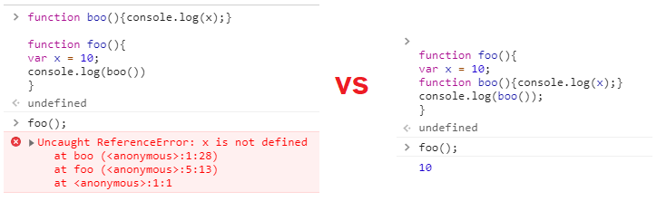
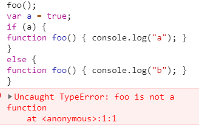

# JavaScript Scope

We are trying to wrapp this concept once for all. So lets learn some definitions:

#### What is the meaning of `Scope`?

**A**: Scope determines the accessibility (visibility) of variables. There are 2 types of scopes `lexical/static` vs `dynamic`. `Javascript, C,Java,Python` which are defined at `lexing time`.[W3schools](https://www.w3schools.com/js/js_scope.asp)

#### What is the meaning of `Lexing time`?

We have two Concepts `lexical/static scope` vs `dynamic scope`:

- `Lexical/static scope`: lexical scope is based on where variables and blocks of scope are authored, by you, at write time(`Compile time`), and thus is (mostly) set in stone by the time the lexer processes your code([read episode1](./episode1.md)). e.g. `Javascript, c,python,...` are lexical scope.
- `Dynamic scope`: the runtime state of the program stack determines what variable you are referring to, which means `variable lookups` is based on where and when the name is encountered. e.g. `lisp`, `r` are dynamic scope [cs.washington.edu](https://homes.cs.washington.edu/~bodik/ucb/cs164/sp13/files/display.pdf)

consider these two examples in a lexical scope language like javascript:

<table>
<tr>
<th> `boo` defined outside of foo </th>
<th> `boo` defined inside foo </th>
</tr>
<tr>
<td>

```javascript
function boo() {
  console.log(x);
}

function foo() {
  var x = 10;
  console.log(boo());
}
foo(); // Uncaught ReferenceError: x is not defined
```

</td>

<td>

```javascript
function foo() {
  var x = 10;
  function boo() {
    console.log(x);
  }
  console.log(boo());
}
//output: 10;
```

</td>
</tr>
<tr>
<td> `boo` defined outside of foo </td>
<td> `boo` defined inside foo </td>
</tr>
</table>



##### Types of Scope

- `Global Scope` — variables can be accessed everywhere.
- `Function Scope` — variables can be accessed in the boundaries of the function in which they are defined at lexing time.
- `Block Scope` — variables can be accessed in the block in which they are defined lexing time. A block is separated by `{` and `}`.

>

#### What types pf scope does js support?

**A**: Javascript supports 3 types of `scope`, which are `global, function, block` scopes. And we should know that variables using `var` are `function` scope, variables using `let, const` are `block` scope, variables using `function` are `block and function scope`,, variables without any decalration are `global scope.` scopes Scope determines the accessibility (visibility) of variables. e.g.Each function creates a new scope. So, Variables defined inside a function are not accessible (visible) from outside the function.[W3schools](https://www.w3schools.com/js/js_scope.asp)



Lets start with an intersting question:


```javascript
(function () {
  var a = (b = 3);
})();

console.log(b); // 3
console.log(a); // Uncaught ReferenceError: a is not defined

/*https://stackoverflow.com/a/27329475/12666332
lookup(rhs,lfs)
b = 3;
var a = b;
*/
```
