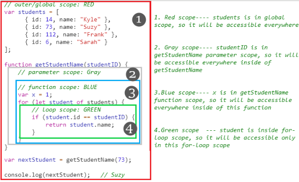

# JavaScript Scope

Lets start with a really intersting question:

```javascript
(function () {
  var a = b = 3;
})();

console.log(b); // 3
console.log(a); // Uncaught ReferenceError: a is not defined

/*https://stackoverflow.com/a/27329475/12666332
lookup(rhs,lfs)
b = 3;
var a = b;
*/
```

#### What is the meaning of `Scope`?

**A**: Scope determines the accessibility (visibility) of variables. e.g.Each function creates a new scope. So, Variables defined inside a function are not accessible (visible) from outside the function.[W3schools](https://www.w3schools.com/js/js_scope.asp)


