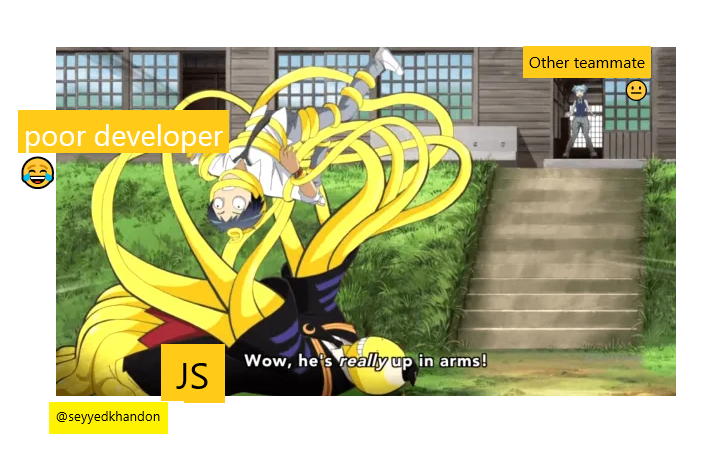
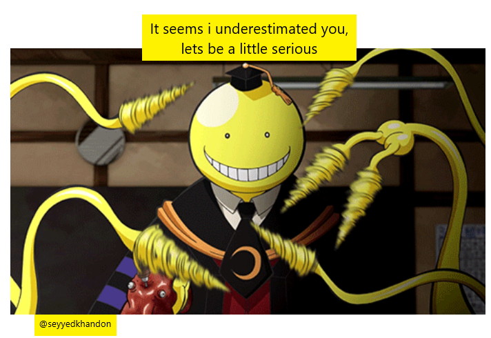
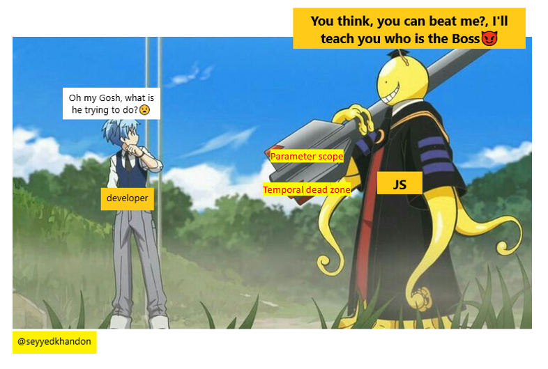

# Preview Story

## Persian:

ناگیسا(هم تیمی در حال فریاد زدن از دور): هییی کوروسنسی،چیکار داری میکنیییی؟
کورو سنسی(js): دارم دهنشو سرویس میکنم، میبینی چطوری توی کدایی که گفتم گیرپاژ کرده و نمیتونه بیاد بیرون(خنده شیطانی)
ناگیسا: اوه اوهه، ببین you، جواب این سواله اینطوریه بهش اینو بگو. زودباش بهش بگو این میشه جوابش...
you:(درحالی که دهنش بسته هست و به سختی میگه) جواب رو میگه(تو یه ابر کنار دهنش باز میشه که جواب توشه)
کوروسنسی: میگه که اینطور هاا؟( حالا کوروسنسی، یکمی شلش میکنه ولی خب داره همچنان اذیتش میکنه ) و میگه که این چطور؟ اینو هم میتونی جواب بدی؟؟؟
you: که داره فکر میکنه و گیر کرده، یهو karma میاد کمک و
karma: میگه بهش اینو بگو ...
.........

حالا میزارتش پایین و اینجا بهشون میگه به نظر میرسه شما رو دست کم گرفته بودم، ببینم اینجا چیکار میکنین...
اینجا کارما،  ناگیسا و کایده میان سه تایی کمی مشورت میکنن سر این کده و بعدش هر کدوم  میان یه تیکه از نظرشونو در باره این تیکه کده میگن و بهش میگن که بگو اینجا چون هویست داستانش اینه که تعاریف یعنی Declarationها رو بالا
میبره، بنابراین این کده تقریبا میشه معادل این تیکه، پس خروجی اگر گام اول این باشه و .... تا اینکه این چاپ میشه یا فلان اتفاق میوفته
.......
بعد اینجا سه تایی به همدیگه دست میدن کهتوسنتن این مرحله رو حل بکنن

کورو سنسی: فکر کردین اینا رو حل کردین دیگه تمومه ها؟؟ بهتون نشون میدم که اینجا کی ریسه
که level3,4,5
میره برای ایپزود یک و بعدی ها که اونجا بیایم باقی تسک ها رو پیش ببریم
